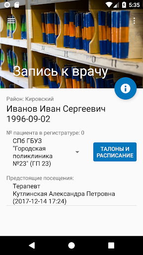

# rev65

<p>Composer && Jetpack</p>
<p>Published on GooglePlay as <a href="https://play.google.com/store/apps/details?id=ru.healthy">mobiskif</a></p>


# Header 1
## Header 2
### Header 3

- Bulleted
- List

1. Numbered
2. List

**Bold** and _Italic_ and `Code` text

[Link](https://play.google.com/store/apps/details?id=ru.healthy) and 


<!--
```markdown
Syntax highlighted code block

# Header 1
## Header 2
### Header 3

- Bulleted
- List

1. Numbered
2. List

**Bold** and _Italic_ and `Code` text

[Link](url) and 
```
-->